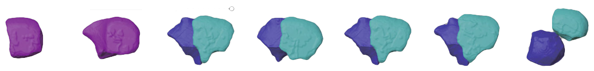

 

This is the official implementation of <a href="https://www.nature.com/articles/s41467-020-19863-x">CShaper</a> published by <I>Nature Communications</I>. It is developed for segmenting densely distributed cells at single-cell elevel, supporting detailed morphological analysis on developmental cells with live-cell microscopy. CShaper was extensively tested on <i>C. elegans</i>, but it should work for other kinds of membrane images (possibly with re-retraining process).

<h2>Usage</h2>

<b>Note</b>: This repository targets for runing CShapper with command lines. If you want to process your data with user-friendly GUI, pls prefer to <a href="https://github.com/cao13jf/CShaperApp" target="_blank">CShaperApp</a>.

<b>Step 1</b>: clone this repository and install requirements with conda:

<pre><code class="language-bash">
git clone --depth 1 https://github.com/cao13jf/CShaper.git
cd CShaper
conda env create -f environment.yml
</code></pre>

<b>Step 2</b> (optional): train CShaper. Parameters in <code>configs/train.txt</code> should be adjusted accordingly. You may refer to the <a href=""https://portland-my.sharepoint.com/:f:/g/personal/jfcao3-c_my_cityu_edu_hk/Eue4QUFfU1lJpjfakesY6ssBURzkI4H3iK57fgPsO4ZyrA?e=i9mOKp target="_blank">example data</a> to organize your own dataset.

<pre><code class="language-bash">
python train.py --cf configs/train.txt
</code></pre>

<b>Step 3</b>: Test CShaper. Parameters for testing CShaper are listed in <code>configs/test.txt</code>. Pretrained model can be downloaded at <a href="https://drive.google.com/drive/folders/1qJ9vJZaXENqiw0x9SGDuFiXTgmkfovVd?usp=drive_link" target="_blank">Google Drive</a>.

<pre><code class="language-bash">
python test.py --cf configs/test.txt
</code></pre>

<b>Note</b>: Code for shape analysis is not included in this repository.

<h2>Correspondence</h2>

Please contact Jianfeng Cao at jianfeng13.cao(at)gmail.com if you have any question about the source code or dataset.

<h2>Citation</h2>

If this work is useful for you, pls consider the citation.

<pre><code>
@article{cao2020establishment,
  title={Establishment of a morphological atlas of the Caenorhabditis elegans embryo using deep-learning-based 4D segmentation},
  author={Cao, Jianfeng and Guan, Guoye and Ho, Vincy Wing Sze and Wong, Ming-Kin and Chan, Lu-Yan and Tang, Chao and Zhao, Zhongying and Yan, Hong},
  journal={Nature communications},
  volume={11},
  number={1},
  pages={6254},
  year={2020},
  publisher={Nature Publishing Group UK London}
}
</code></pre>
