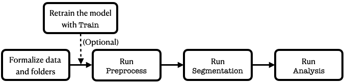
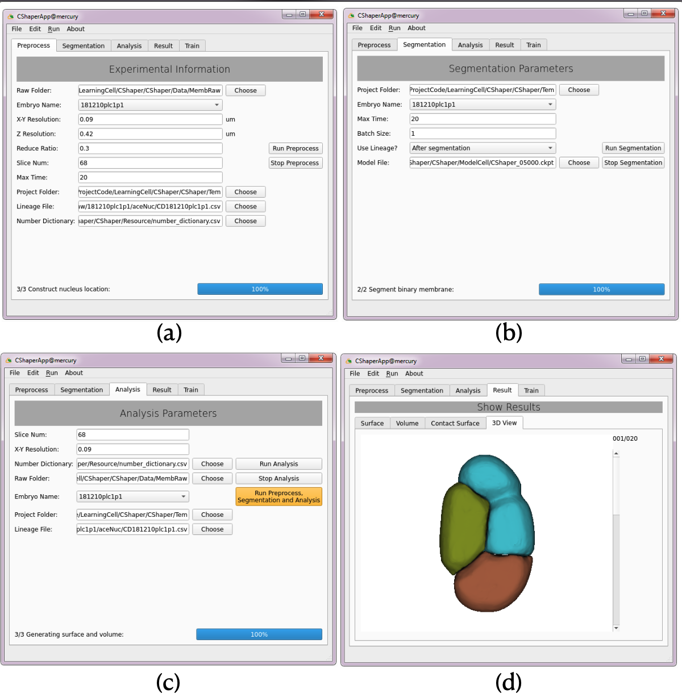

<p align="center"></p>
<h1 align="center"> Document of CShaperApp</h1>
<h2>

<ol>
    <li>
        <a href="#introduction">Introduction</a>
    </li>
    <li>
        <a href="#installation">Installation</a>
    </li>
    <li>
        <a href="#usage">Usage</a>
    </li>
    <ol style="type=a">
        <li>
            <a href="#usage_folder">Folder Structure</a>
        </li>
        <li>
            <a href="#usage_preprocess">Preprocess</a>
        </li>
        <li>
            <a href="#usage_segmentation">Segmentation</a>
        </li>
        <li>
          <a href="#usage_analysis">Analysis</a>
        </li>
        <li>
          <a href="#usage_result">Result</a>
        </li>
        <li>
          <a href="#usage_train">Train</a>
        </li>
    </ol>
    <li>
      <a href="#development">Development</a>
    </li>
    <li><a href="#correspondence">Correspondence</a></li>
</ol>
 
<HR SIZE=10>
  1. Introduction
</h2><a name="introduction"></a>

  <p align="justify">This document describes the usage of CShaperApp. CShaperApp is built based on the CShaper published in <I>Nature Communications</I>, which adopts the deep learning to segment the <I>C. elegans</I> emebyro at single-cell elevel (Cao JF <I>et al.</I>, <I>Nat. Commun</I>, 2020).</p>

  <p align="justify">Briefly speaking, CShaperApp is composed of five functional sections, including <code>Preprocess</code>, <code>Segmentation</code>, <code>Analysis</code>,  <code>Result</code> and <code>Train</code>. While the first four parts are designed to be excuted sequentially, the user can choose to train the model with <code>Train</code> module. In order to use this software efficiently, especially for functions <code>Segmentation</code> and <code>Train</code>, GPU acceleration is preferred. However, all components has been tested successfully on basic desktop (RAM=16G, no GPU).</p>

<br/>
<h2>2. Installation</h2><a name="installation"></a>
<p align="justify">The user can download the installer of CShaperApp from this <a href="https://portland-my.sharepoint.com/:f:/g/personal/jfcao3-c_my_cityu_edu_hk/EvnmhUKFIatNu9eU4RqyCwABf984vWW2OCTS89rz_HRODw?e=ssvWfe">link</a>. The pretrained model and name dictionary can be downloaded as <a href="https://portland-my.sharepoint.com/:f:/g/personal/jfcao3-c_my_cityu_edu_hk/EjO6I1f8p5JNmnX9oP1QrSEBsjSxrhXJSmt4_SKMlyqoOA?e=4qPLBS">Resource</a> file. CShaperApp was tested on Windows 7 and Windows 10 (64 bit). For the user's reference, we list the time that CShaperApp takes to process the example dataset <I>181210plc1p1</I>.</p>

<p align="center">
  <table>
    <tr>
      <th>Platform</th>
      <th>Performance</th>
      <th>Preprocess</th>
      <th>Segmentation</th>
      <th>Analysis</th>
    </tr>
    <tr>
      <td>Windows 10</td>
      <td>16G RAM, 4 cores, no GPU</td>
      <td>45 s</td>
      <td>33 min 32 s</td>
      <td>30 s</td>
    </tr>
    <tr>
      <td>Windows 10</td>
      <td>64G RAM, 48 cores, GPU 2080Ti</td>
      <td>6 s</td>
      <td>3 min 7 s</td>
      <td>7 s</td>
    </tr>
  </table>
</p>

<br/>
<h2>3. Usage</h2><a name="usage"></a>
<p align="justify">With the help of microscopy, fluorescent signals of nucleus and membrane are collected through two channels respectly. These images are saved slice by slice. <B>Preprocess</B> is used to compose these slices into a volume according to the user's config. Subsequently, <B>Segmentation</B> is used to segment these volumetric images. <B>Analysis</B> is designed to collect the biological information, such as volume and surface, from the segmentation result. Finally, <B>Result</B> can be used to inspect the segmentation results interactively. For the large potential difference between different datasets, <code>Train</code> can be optionally used to retintrain the model.</p>

The user can get familiar with the usage of CShaperApp by following the steps in the figure as follows. 

<p align="center"></p>

<h3>3.0 Folder Structure</h3><a name="usage_folder"></a>
<p align="justify">The folders which are required or generated by CShaperApp are listed here. To get a perceptual view on the structure of the workplace, the user can refer to our example [<a href="https://portland-my.sharepoint.com/:f:/g/personal/jfcao3-c_my_cityu_edu_hk/Eue4QUFfU1lJpjfakesY6ssBURzkI4H3iK57fgPsO4ZyrA?e=i9mOKp">link</a>], where the example dataset can be also found.</p>

```html
# 181210plc1p1 is the name of an embryo sample, which can be configured.

Raw Folder/: raw image folder
  |--181210plc1p1/: embryo name
     |--aceNuc/: nucleus lineage file from StarryNite and AceTree
     |--tif/: raw nucleus image
     |--tifR/: raw membrane image
Project Folder/: the target folder where all results will be saved
  |--CellMembrane/: binary membrane surface
  |--CellMembranePostseg/: segmentation results
     |--181210plc1p1/: cell segmentations without cell labels
     |--181210plc1p2LabelUnified/: cell segmentations whose labels can be queried
  |--NucleusLoc/: nucleus location information
  |--RawStack/: stacked membrane and nucleus images
  |--StatShape/: statistical results from the segmentations
     |--181210plc1/: embryo name
        |--181210plc1_contact.csv: cell-cell contact surface
        |--181210plc1_surface.csv: cell surface area
        |--181210plc1_volume.csv: cell volume
  |--TemCellGraph/: Temporary results 
Resource/: resources that are required by CShaperApp
  |--number_dictionary.csv: pairwise cell name and digital label in the segmentation
  |--TrainedModel/: pretrained model for the deep learning framework
```

<p align="justify">In these files, <code>Raw Folder</code> is the data that the user needs to process. All data generated by CShaperApp directly or indirectly will be saved to <code>Project Folder</code>. <code>Resource</code> includes the trained model that can downloaded through the preivous link. </p>

<h3>3.1 Preprocess</h3><a name="usage_preprocess"></a>
<p align=" justify">The user needs to set meta-information about the image data. The meaning of each parameters is listed as follows (based on the example data).</p>
<h4>Parameters</h4>
<details><summary>Parameter list</summary><div>
<table style="width: 80%">
  <tr>
    <th>Name</th>
    <th>Value</th>
    <th>Example</th>
  </tr>
  <tr>
    <td>Raw Folder</td>
    <td>name of raw data folder</td>
    <td>root/MembRaw</td>
  </tr>
  <tr>
    <td>Embryo Name</td>
    <td>Name of the embryo</td>
    <td>181210plc1p1</td>
  </tr>
  <tr>
    <td>X-Y Resolution</td>
    <td>Intra-slice resolution (&#956m)</td>
    <td>0.09</td>
  </tr>
  <tr>
    <td>Z Resolution</td>
    <td>Inter-slice resolution</td>
    <td>0.42</td>
  </tr>
  <tr>
    <td>Reduce Ratio</td>
    <td>The scale of image to be reduced. Setting this value to be smaller will reduce the time the <B>Segmentation</B> takes, but the resolution will be reduced</td>
    <td>0.3</td>
  <tr>
    <td>Slice Num</td>
    <td>The number of slices at each time point</td>
    <td>68</td>
  </tr>
  <tr>
    <td>Max Time</td>
    <td>The largest time points to be processed (start from t=1)</td>
    <td>100</td>
  </tr>
  <tr>
    <td>Lineage File</td>
    <td>The nucleus lineage file (from StarryNite and AceTree)</td>
    <td>root/MembRaw/181210plc1p1/aceNuc/CD181210plc1p1.csv</td>
  </tr>
  <tr>
    <td>Number Dictionary</td>
    <td>The dictionary used for finding out the cell name according to the segmentation results because only integers as opposed to strings are saved.</td>
    <td>root/Resource/number_dictionary.csv</td>
  </tr>
</table>
</div></details>

<h4>Results</h4>
<p align="justify">Membrane or nucleus slices at each time point are composed together as volumetric stacks. These volumetric stacks are saved as <code>*.nii.gz</code> files under folder <code>Project Folder/MembRaw</code>, which can be loaded by <a href="http://www.itksnap.org/pmwiki/pmwiki.php">itk-SNAP</a>.</p>

<h3>3.2 Segmentation</h3><a name="usage_segmentation"></a>
<p align="justify">At this stage, some parameters are assumed to be the same as that of <B>Preprocess</B>. If not, the user can change the settings but please make sure the embryo to be segmented has been processed by the stage <B>Preprocess</B>.</p>
<h4>Parameters</h4>
<details>
  <summary>Parameter list</summary><div>
  <table>
    <tr>
      <th>Name</th>
      <th>Value</th>
      <th>Example</th>
    </tr>
    <tr>
      <td>Project Folder</td>
      <td><B>Preprocess</B></td>
      <td><B>Preprocess</B></td>
    </tr>
    <tr>
      <td>Embryo Names</td>
      <td><B>Preprocess</B></td>
      <td><B>Preprocess</B></td>
    </tr>
    <tr>
      <td>Max Time</td>
      <td><B>Preprocess</B></td>
      <td><B>Preprocess</B></td>
    </tr>
    <tr>
      <td>Batch Size</td>
      <td>The number of images to be computed in parallel. The value should be set based on your computer resources (i.e., GPU).</td>
      <td>1</td>
    </tr>
    <tr>
      <td>Use Lineage</td>
      <td>Three cases: no lineage; after segmentation (used in CShaper, cell cavity can be detected); before segmentation (nuclei are used as seeds in watershed segmentation, so cell cavity cannot be detected)</td>
      <td>After Lineage</td>
    </tr>
    <tr>
      <td>Model File</td>
      <td>The file of pretrained model</td>
      <td>root/Resource/TrainedModel/DMapNet_pub_5000.ckpt</td>
    </tr>
  </table>
  </div>
</details>
<h4>Results</h4>
<p align="justify">Volumetric raw images are further segmented at single-cell level. Segmentations are saved at folder <code>Project Folder/CellMembranePostseg/181210plc1p2</code>. The user can <I>visually inspect the segmentation performance by loading the raw image (from <B>Preprocess</B>) and the segmentation with itk-SNAP</I>. Please note that at this stage, cells are not strictly lablled according to the <code>name_dictionary.csv</code>, which remains to be solved in <B>Analysis</B>.</p>
<h3>3.3 Analysis</h3><a name="usage_analysis"></a>
<p align="justify">Section <B>Analysis</B> will collect cell morphological information, including cell volume, cell surface area and cell-cell contact area. It also combines two daughter cells during the the division process in which case one cell includes two nuclei.</p>
<h4>Parameters</h4>
<details>
  <summary>Parameter list</summary><div>
    <table>
      <tr>
        <th>Name</th>
        <th>Value</th>
        <th>Example</th>
      </tr>
      <tr>
        <td>Slice Num</td>
        <td><B>Preprocess</B></td>
        <td><B>Preprocess</B></td>
      </tr>
      <tr>
        <td>Number Dictionary</td>
        <td><B>Preprocess</B></td>
        <td><B>Preprocess</B></td>
      </tr>
      <tr>
        <td>Raw Folder</td>
        <td><B>Preprocess</B></td>
        <td><B>Preprocess</B></td>
      </tr>
      <tr>
        <td>Embryo Names</td>
        <td><B>Preprocess</B></td>
        <td><B>Preprocess</B></td>
      </tr>
      <tr>
        <td>Project Folder</td>
        <td><B>Preprocess</B></td>
        <td><B>Preprocess</B></td>
      </tr>
      <tr>
        <td>Lineage File</td>
        <td><B>Preprocess</B></td>
        <td><B>Preprocess</B></td>
      </tr>
    </table>
  </div>
</details>
<p align="justify">The user can set all parameters in <B>Preprocess</B>, <B>Segmentation</B> and <B>Anlysis</B> once, and runs them together.</p>

<h4>Results</h4>
<p align="justify">Morphological information are saved to <code>StatShape</code>. These results can be either viewed in section <B>Result</B> or processed for different needs.</p>
<h3>3.4 Result</h3><a name="usage_result"></a>
<p align="justify">This part provides a window for the user to view both the segmentation results and the collected information. All tables are exportable for further studies. In <code>3D</code> component, the user can inspect the segmentation results at each time point interactively. Please note that because all segmentations are preloaded here, this function might be computationally consuming when there are too many time points. Besides, CShaperApp concentrates on segmenting the embryo data, so we recommend the <a href="http://www.itksnap.org">itk-SNAP</a> to the user for user-friendly interface to view the results.</p>

<h3>3.5 Train</h3><a name="usage_train"></a>
<p align="justify">In order to deliver reasonable results on your own dataset, retraining the model is recommended, especially when the meta-information varies a lot with the dataset used by CShaper. The model can be easily trained with the user interface <code>Train</code>. </p>
<h4>Parameters</h4>
<details>
  <summary>Parameter list</summary><div>
    <table>
      <tr>
        <th>Name</th>
        <th>Value</th>
        <th>Example</th>
      </tr>
      <tr>
        <td>Data Folder</td>
        <td>The root folder of training dataset</td>
        <td>root/MembraneTrain</B></td>
      </tr>
      <tr>
        <td>Data Names</td>
        <td>The datasets used for training</td>
        <td>181210plc1p1; 181210plc1p2</td>
      </tr>
      <tr>
        <td>Batch Size</td>
        <td>The batch size used for training</td>
        <td>2</td>
      </tr>
      <tr>
        <td>Model Name</td>
        <td><B>The name of model to be saved</B></td>
        <td><B>CShaper</B></td>
      </tr>
      <tr>
        <td>Save Folder</td>
        <td><B>The folder of model to be saved</B></td>
        <td><B>Resource/TrainedModel</B></td>
      </tr>
    </table>
  </div>
</details>

<h4>Results</h4>
<p align="justify">The trained model will be saved as three files (<code>*.index</code>, <code>*.meta</code>, <code>*001</code>) under <code>Save Folder</code>. At the <code>Segmentation</code> stage, any one of them can be filled into <code>Model File</code>.</p>

<p align="center"></p>
<p align="center">Demo of CShaperApp</p>

<h2>4. Development</h2><a name="development"></a>
<p align="justify">For user whoe wants to extend the usage of CShaperApp, the development environment can be constructed by following:</p>

```shell
# create environment
conda create -n cshaptertf python=3.9.13
pip install -r requirements.txt

# Packkage the library
pyinstaller CShaperApp_MacOS.spec
```
The packaged software can be found at `dist/CShaperApp`.

<br/>
<h2>5. Correspondence</h2><a name="correspondence"></a>
<p>Please contact Jianfeng Cao at jfcao3-c(at)my.cityu.edu.hk or create an issue under this source code repository.</p>

<br/>
<h2>Important notes</h2>
<!--
1. For functions <code>Segmentation</code> and <code>Train</code>, we release the GPU resource with <i>numba</i> tool to
 prevent OOM error. However, it may throw error message <code>status: Internal: context is destroyed</code> if 
you run <code>Segmentation</code> or <code>Train</code> together or each for twice. Closing the window and running these 
functions again are recommended.
-->
1). Due to the considerable computation resource required on 3D rendering in function `Result/3D View`, it's highly recommended
to run this function only when the number of time point is small, otherwise the software may be nonresponsive for the lack of 
memory;

2). If retraining the model is needed, the folder structure should strictly follow that referred in <a href="#usage_folder">Folder Structure</a>.


<br/>
<h2>License</h2>
<p align="justify">The license can be found <a href="https://github.com/cao13jf/CShaperApp/blob/master/LICENSE">here</a>.</p>
