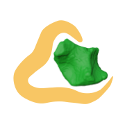

## CShaper

Implementation for *Establishment of a morphological atlas of the Caenorhabditis elegans embryo using deep-learning-based 4D
 segmentation*, by Jianfeng Cao<sup>#</sup>, Guoye Guan<sup>#</sup>, Vincy Wing Sze Ho<sup>#</sup>, Ming-Kin Wong, Lu-Yan Chan, Chao Tang, Zhongying Zhao, & Hong Yan.
 
<sup>#</sup> equal contribution

### Update
* **2023.12** We have developed desktop software  [CShaperApp](https://github.com/cao13jf/CShaperApp) that integrates the training, prediction and analysis parts of CShaper framework. The backbone 
and user interface have been improved. We highly recommend users to process the dataset with this open-source software.


### Usage
This implementation is based on Tensorflow and python3.6, trained with one GPU NVIDIA 2080Ti on Linux. Steps for training
and testing are listed as below.
* **Intsall dependency library**:
```buildoutcfg
    conda env create -f requirements.yml
```
* **Train**: Download the data from this [link](https://portland-my.sharepoint.com/:f:/g/personal/jfcao3-c_my_cityu_edu_hk/EiL29xWYq2tGg5f4kXSsr3ABQ1hzBNGXesR4ySpe1GR5wQ?e=TRSWS0) and put it into `./Data` folder, Set parameters
in `./ConfigMemb/train_edt_discrete.txt`, then run
    ```buildoutcfg
    python train.py --cf ./ConfigMemb/train_edt_discrete.txt
    ```
* **Test**: Put the raw data (membrane and nucleus stack, and CD files from [AceTree](https://www.ncbi.nlm.nih.gov/pmc/articles/PMC1501046/))
into `./Data/MembValidation/`. The pretrained model is available through the [Google Drive](https://portland-my.sharepoint.com/:f:/g/personal/jfcao3-c_my_cityu_edu_hk/EsFepd81qjtBqsAZ_IJ58SsB58n2en1HGov5dnGHA1RCtw?e=JtdNuL), which should be unzip to `./ModelCell/`. Example data is also available through previous data link. Set parameters in 
`./ConfigMemb/test_edt_discrete.txt` and run
    ```buildoutcfg
    python test_edt.py ./ConfigMemb/test_edt_discrete.txt
    ```
    Then binary membrane and initial segmented cell are saved in `./ResultCell/BothWithRandomnet` and
    `BothWithRandomnetPostseg`, respectively. To unify the label of cell based on AceTree file,
    run 
    ```buildoutcfg
    python shape_analysis.py ./ConfigMemb/shape_config.txt
    ```
* **Structure of folders**: (Folders and files in `.gitignore` are not shown in this repository)
    ```buildoutcfg
    DMapNet is used to segmented membrane stack of C. elegans at cellular level
    DMapNet/
      |--configmemb/: parameters for training, testing and unifying label
      |--Data/: raw membrane, raw nucleus and AceTree file (CD**.csv)
          |--MembTraining/: image data with manual annotations
          |--MembValidation/: image data to be segmented
      |--ModelCell/: trained models 
      |--ResultCell/: Segmentation result
          |--BothWithRandomnet/: Binary membrane segmentation from DMapNet
          |--BothWithRandomnetPostseg/: segmented cell before and after label unifying
          |--NucleusLoc/: nucleus location information and annotation
          |--StatShape/: cell lineage tree (with time duration)
      |--ShapeUtil/: utils for unifying cells and calculating robustness
          |--AceForLabel/: multiple AceTree files for generating namedictionary
          |--RobustStat/: nucleus lost sration and cell surface...
          |--TemCellGraph/: temporary result for calculating surface, volume...
        
      |--Util/: utils for training and testing
    ```
    Result folders will be automatically built.
Codes for the normalization (e.g., resize, rotation) on the segmentation results are available at [CShaperPost](https://github.com/cao13jf/CShaperPost).
### Related
* Project file for CellProfiler involved in evaluation ([link](https://portland-my.sharepoint.com/:u:/g/personal/jfcao3-c_my_cityu_edu_hk/ETN3Z6j4TklAko6NvQDIujwBwzoixX26EajSOaoeeme2jg?e=SxPp45)).
* Parameter files for RACE ([link](https://portland-my.sharepoint.com/:u:/g/personal/jfcao3-c_my_cityu_edu_hk/EX_iCNByGBtMlZI7G8bRgSMBqNfaCdAbq3cHDrGc-k6d5Q?e=HoYX0w)). 

### Acknowledgements
* [brats17](https://github.com/taigw/brats17);
* [niftynet](https://niftynet.io).

### Contact
jfcao3-c(at)my.cityu.edu.hk

### Citation
If our work is helpful for you, please consider the citation. `Cao, J., Guan, G., Ho, V.W.S. et al. Establishment of a morphological atlas of the Caenorhabditis elegans embryo using deep-learning-based 4D segmentation. 
Nat Commun 11, 6254 (2020). https://doi.org/10.1038/s41467-020-19863-x`
